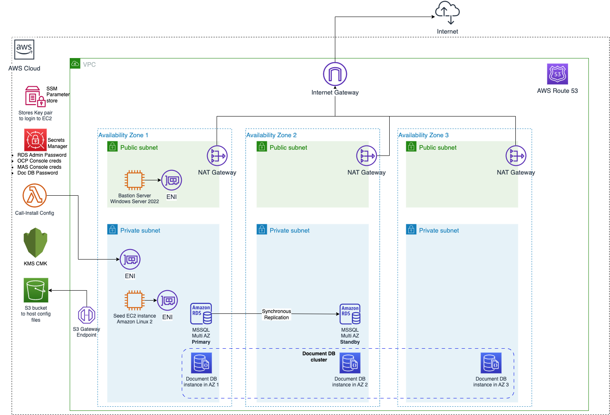

# Installing Maximo Application Suite 8.x on a private OpenShift Container Platform cluster
This repository is part of an AWS Workshop, [IBM Maximo Application Suite 8.x on AWS](https://catalog.us-east-1.prod.workshops.aws/workshops/78554b88-0cd8-45a1-b9ee-2c1078aa6995/en-US). For detailed instructions please follow the workshop.
## Note
IBM Maximo is a commercial off the shelf (COTS) licensed software. You will need the below prior to proceeding with the installation.
* An IBM Container registry key, aka. IBM Entitlement **key** that allows you access to download necessary container images for the installation.
* A MAS License Entitlement **file** that is generated from the IBM License Key Center which provides access to use MAS applications.
* A RedHat Cloud console account and pull secret allowing you to install and configure an OpenShift Container Platform instance.

It is assumed that the audience following the workshop has a Level 100-200 knowledge of RedHat OpenShift and IBM Maximo.

The following set of instructions have been tested with the following Product versions:
* RedHat OpenShift Cluster 4.12.18
* Maximo Application Suite 8.6
* AWS RDS MS SQL 2019

## Deploying the AWS infrastructure (using AWS CloudFormation)
To deploy the AWS infrastructure that hosts the Private OCP cluster in a AWS Commercial cloud region, Click on 
<a href="https://console.aws.amazon.com/cloudformation/home?#/stacks/new?&templateURL=https://ws-assets-prod-iad-r-iad-ed304a55c2ca1aee.s3.us-east-1.amazonaws.com/78554b88-0cd8-45a1-b9ee-2c1078aa6995/mainTemplate.yaml">Launch Template in Commercial Cloud</a>
To deploy in a AWS GovCloud(US) cloud region, Click on 
<a href="https://console.amazonaws-us-gov.com/cloudformation/home?#/stacks/new?&templateURL=https://ws-assets-prod-iad-r-iad-ed304a55c2ca1aee.s3.us-east-1.amazonaws.com/78554b88-0cd8-45a1-b9ee-2c1078aa6995/mainTemplate.yaml">Launch Template in AWS GovCloud(US)</a>

The CFN stack along with all the nested stacks deploys the below architecture 


* Once deployed login to Bastion Host and download SQL Server Management Studio (SSMS) [here](https://learn.microsoft.com/en-us/sql/ssms/download-sql-server-management-studio-ssms?view=sql-server-ver16) and connect to the MSSQL RDS instance. Use SQL server Authentication and use the ``admin`` credentials to login to the RDS instance. 
* Create a new user ``maximo`` under ``Security>Logins`` and set a password.
* Create a new database and call it ``maxdb80``. Set the initial database size as ``500MB`` for the ``PRIMARY`` Filegroup and allow increments of ``1MB``. For this workshop leave log file size unchanged. 


* Right click the ``maximo`` user and click ``Properties``. Select ``User Mapping`` and click on the checkbox beside ``maxdb80`` and select ``db_owner`` for ``Database role membersh p for: maxdb80`` in the bottom panel of the dialog and hit ``OK``.

    


## Deploying a IBM OCP Private Cluster
Follow the below steps by doing an ``ssh`` to ``PrivateEc2`` instance and running the below scripts as root. 
i.e.
```
sudo su -
```
### Deploying a new OCP cluster
```
./ibm-mas-on-aws/scripts/deploy_cluster.sh "S3_BUCKET_NAME" "CLUSTER_NAME" "BASE_DOMAIN"
```
|Parameter|Description|
|--|--|
|S3_BUCKET_NAME|The S3 bucket that will host the License file, Pull Secret and other configuration files as mentioned in the Pre-Install steps|
|CLUSTER_NAME|Name of the OCP cluster that will be created|
|BASE_DOMAIN|The Name of the base domain that will be used to create the Route53 Hosted Zone. e.g. example.com|

### Creating an RWX storage class
The Alert Manager requires an RWX (Read Write Many) storage class. Follow the commands to create an RWX storage class.
```
./ibm-mas-on-aws/scripts/create_efs_rwx_sc.sh "CLUSTER_NAME" "BASE_DOMAIN"
```
|Parameter|Description|
|--|--|
|CLUSTER_NAME|Name of the OCP cluster that will be created|
|BASE_DOMAIN|The Name of the base domain that will be used to create the Route53 Hosted Zone. e.g. example.com|

### Pending updates using OpenShift client
```
./ibm-mas-on-aws/scripts/pending_oc_updates.sh "BUCKETNAME" "CLUSTERNAME" "BASEDOMAIN"
```
|Parameter|Description|
|--|--|
|BUCKETNAME|The S3 bucket that will host the License file, Pull Secret and other configuration files as mentioned in the Pre-Install steps|
|CLUSTERNAME|Name of the OCP cluster that will be created|
|BASEDOMAIN|The Name of the base domain that will be used to create the Route53 Hosted Zone. e.g. example.com|


### Deploying the Maximo Application Suite on OpenShift Cluster
```
./ibm-mas-on-aws/scripts/deploy_mascore.sh "IBM_ENTITLEMENT_KEY" 
```
|Parameter|Description|
|--|--|
|IBM_ENTITLEMENT_KEY|Name of the OCP cluster that will be created|
|UDS_CONTACT_EMAIL|Email address of the User Data Service contact|
|UDS_CONTACT_FIRSTNAME|First Name of UDS Contact|
|UDS_CONTACT_LASTNAME|Last Name of UDS Contact|
|SLS_LICENSE_ID|The License ID in the License Key file|

### Generate JBDC URL and apply 
```
./ibm-mas-on-aws/scripts/gen_mas_jdbc.sh "MAS_JDBC_USER" "MAS_JDBC_PASSWORD" "MAS_JDBC_URL" "S3URI_CERTPEM_FILE"
```
|Parameter|Description|
|--|--|
|MAS_JDBC_USER|Maximo Database user name. e.g. ``maximo``|
|MAS_JDBC_PASSWORD|Maximo DB Password|
|MAS_JDBC_URL|JDBC Connection String for the Maximo DB. See [link](https://www.ibm.com/docs/en/maximo-manage/8.0.0?topic=suite-deploying-activating-manage) for various JDBC URL samples. E.g. for RDS JDBC URL - ``jdbc:sqlserver://RDSDNS:1433;databaseName=DBNAME;encrypt=true``. This URL is also available in RDS stack CFN output as JDBCConnectionString|
|S3URI_CERTPEM_FILE|S3 URI for the PEM file for the Database|

### Deploy Maximo Manage Application in MAS 
```
./ibm-mas-on-aws/scripts/add_maximo_manage.sh "IBM_ENTITLEMENT_KEY"
```
|Parameter|Description|
|--|--|
|IBM_ENTITLEMENT_KEY|Name of the OCP cluster that will be created|

At this point you should have Maximo Manage deployed into Maximo Application Suite. 
Follow the next steps in the AWS workshop to configure Maximo Manage.

## Cleanup
In order to cleanup, we will first remove the EFS filesystem that was created and then destroy the OpenShift cluster.

### Remove Deletion protection from RDS Instance
Access the RDS console and select the RDS instance created by the CFN Template. Click on ``Modify`` and uncheck the checkbox ``Enable Deletion Protection`` and then click on ``Apply immediately``.

### Removing the EFS Filesystem
```
./ibm-mas-on-aws/scripts/delete_rwx_efs.sh CLUSTER_NAME
```
|Parameter|Description|
|--|--|
|CLUSTER_NAME|Name of the OCP cluster that will be created|

### Destroying the OCP Cluster

```
/root/install-dir/openshift-install destroy cluster --dir /root/install-dir/ --log-level=debug
```
